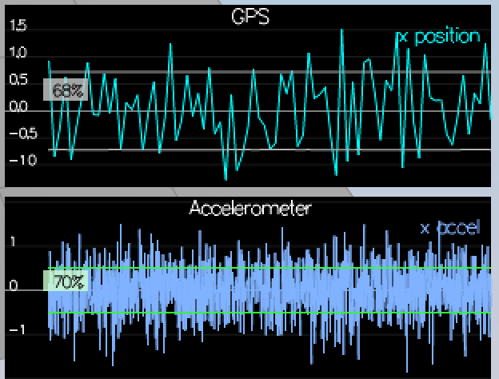
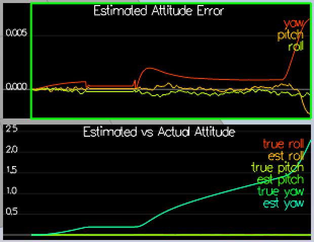
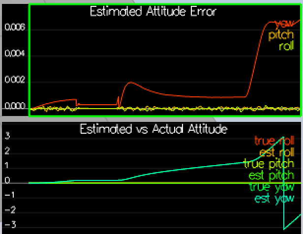
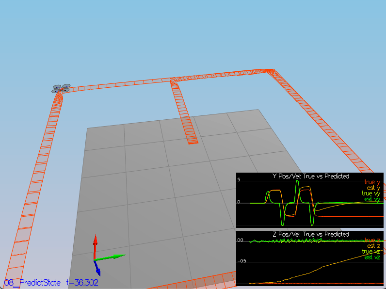
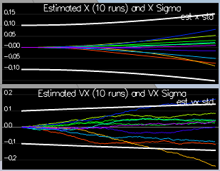
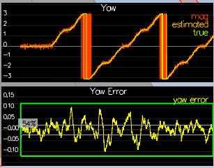
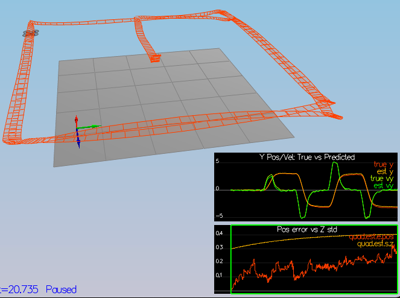
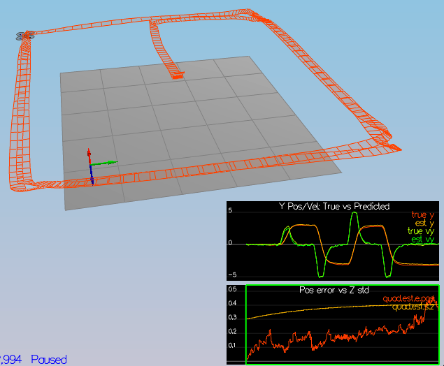

# Estimation Project #

Welcome to the estimation project.  In this project, you will be developing the estimation portion of the controller used in the CPP simulator.  By the end of the project, your simulated quad will be flying with your estimator and your custom controller (from the previous project)!


### Project Structure ###

For this project, you will be interacting with a few more files than before.

 - The EKF is already partially implemented for you in `QuadEstimatorEKF.cpp`

 - Parameters for tuning the EKF are in the parameter file `QuadEstimatorEKF.txt`

 - When you turn on various sensors (the scenarios configure them, e.g. `Quad.Sensors += SimIMU, SimMag, SimGPS`), additional sensor plots will become available to see what the simulated sensors measure.

 - The EKF implementation exposes both the estimated state and a number of additional variables. In particular:

   - `Quad.Est.E.X` is the error in estimated X position from true value.  More generally, the variables in `<vehicle>.Est.E.*` are relative errors, though some are combined errors (e.g. MaxEuler).

   - `Quad.Est.S.X` is the estimated standard deviation of the X state (that is, the square root of the appropriate diagonal variable in the covariance matrix). More generally, the variables in `<vehicle>.Est.S.*` are standard deviations calculated from the estimator state covariance matrix.

   - `Quad.Est.D` contains miscellaneous additional debug variables useful in diagnosing the filter. You may or might not find these useful but they were helpful to us in verifying the filter and may give you some ideas if you hit a block.


## The Tasks ##

Once again, you will be building up your estimator in pieces.  At each step, there will be a set of success criteria that will be displayed both in the plots and in the terminal output to help you along the way.

Project outline:

 - [Step 1: Sensor Noise](#step-1-sensor-noise)
 - [Step 2: Attitude Estimation](#step-2-attitude-estimation)
 - [Step 3: Prediction Step](#step-3-prediction-step)
 - [Step 4: Magnetometer Update](#step-4-magnetometer-update)
 - [Step 5: Closed Loop + GPS Update](#step-5-closed-loop--gps-update)
 - [Step 6: Adding Your Controller](#step-6-adding-your-controller)


### Step 1: Sensor Noise ###

I ran the scenario_06_NoisySensors and recorded the data into the two data files in config/log/Graph1.txt and config/log/Graph2.txt. I then ran the Compute-Std.py on these files to obtain the standard deviations of the Quad.GPS.X and the Quad.IMU.AX data as follows.

```c
GPS X Std: 0.7204664990698312
IMU X Std: 0.5102750028692653
```

This data was used to set the standard deviations on the config/06_SensorNoise.txt file as shown below

```c
MeasuredStdDev_GPSPosXY = 0.72
MeasuredStdDev_AccelXY = 0.52
```

The result when I ran the simulation is shown below with 68% of the measurements falling within the newly set standard deviation bounds.



The test passed as shown below.

```c
Simulation #3 (../config/06_SensorNoise.txt)
PASS: ABS(Quad.GPS.X-Quad.Pos.X) was less than MeasuredStdDev_GPSPosXY for 68% of the time
PASS: ABS(Quad.IMU.AX-0.000000) was less than MeasuredStdDev_AccelXY for 70% of the time
```


### Step 2: Attitude Estimation ###

I used the original linear integration code as shown below and the resulting plot follows. Clearly the error in the estimated roll pitch and yaw are large.

```c++
void QuadEstimatorEKF::UpdateFromIMU(V3F accel, V3F gyro)
{
  ////////////////////////////// BEGIN STUDENT CODE ///////////////////////////
  // SMALL ANGLE GYRO INTEGRATION:
  // (replace the code below)
  // make sure you comment it out when you add your own code -- otherwise e.g. you might integrate yaw twice

  float predictedPitch = pitchEst + dtIMU * gyro.y;
  float predictedRoll = rollEst + dtIMU * gyro.x;
  ekfState(6) = AngleNormF(ekfState(6) + dtIMU * gyro.z);

  /////////////////////////////// END STUDENT CODE ////////////////////////////

  // CALCULATE UPDATE
  accelRoll = atan2f(accel.y, accel.z);
  accelPitch = atan2f(-accel.x, 9.81f);

  // FUSE INTEGRATION AND UPDATE
  rollEst = attitudeTau / (attitudeTau + dtIMU) * (predictedRoll) + dtIMU / (attitudeTau + dtIMU) * accelRoll;
  pitchEst = attitudeTau / (attitudeTau + dtIMU) * (predictedPitch) + dtIMU / (attitudeTau + dtIMU) * accelPitch;

  lastGyro = gyro;
}

```



I then changed the implementation to the non linear integration using the body rate using quaternions and the resulting error in the roll pitch and yaw estimates are much smaller as shown the following graph.

```c++
void QuadEstimatorEKF::UpdateFromIMU(V3F accel, V3F gyro)
{  
  ////////////////////////////// BEGIN STUDENT CODE ///////////////////////////
  // SMALL ANGLE GYRO INTEGRATION:
  // (replace the code below)
  // make sure you comment it out when you add your own code -- otherwise e.g. you might integrate yaw twice
  
  // Non linear integration of the body rate using quaternions.
  Quaternion<float> q = Quaternion<float>::FromEuler123_RPY(rollEst, pitchEst, ekfState(6));
  q.IntegrateBodyRate(gyro, dtIMU);
  
  float predictedPitch = q.Pitch();
  float predictedRoll = q.Roll();
  ekfState(6) = AngleNormF(q.Yaw());

  /////////////////////////////// END STUDENT CODE ////////////////////////////

  // CALCULATE UPDATE
  accelRoll = atan2f(accel.y, accel.z);
  accelPitch = atan2f(-accel.x, 9.81f);

  // FUSE INTEGRATION AND UPDATE
  rollEst = attitudeTau / (attitudeTau + dtIMU) * (predictedRoll) + dtIMU / (attitudeTau + dtIMU) * accelRoll;
  pitchEst = attitudeTau / (attitudeTau + dtIMU) * (predictedPitch) + dtIMU / (attitudeTau + dtIMU) * accelPitch;

  lastGyro = gyro;
}
```





***Success criteria:*** *Your attitude estimator needs to get within 0.1 rad for each of the Euler angles for at least 3 seconds.*. This passed as shown below.

```c
Simulation #63 (../config/07_AttitudeEstimation.txt)
PASS: ABS(Quad.Est.E.MaxEuler) was less than 0.100000 for at least 3.000000 seconds
```


### Step 3: Prediction Step ###

In this next step you will be implementing the prediction step of your filter.


1. Run scenario `08_PredictState`.  This scenario is configured to use a perfect IMU (only an IMU). Due to the sensitivity of double-integration to attitude errors, we've made the accelerometer update very insignificant (`QuadEstimatorEKF.attitudeTau = 100`).  The plots on this simulation show element of your estimated state and that of the true state.  At the moment you should see that your estimated state does not follow the true state.

   

2. In `QuadEstimatorEKF.cpp`, implement the state prediction step in the `PredictState()` functon. If you do it correctly, when you run scenario `08_PredictState` you should see the estimator state track the actual state, with only reasonably slow drift, as shown in the figure below:

   

3. Now let's introduce a realistic IMU, one with noise.  Run scenario `09_PredictionCov`. You will see a small fleet of quadcopter all using your prediction code to integrate forward. You will see two plots:
   - The top graph shows 10 (prediction-only) position X estimates
   - The bottom graph shows 10 (prediction-only) velocity estimates
     You will notice however that the estimated covariance (white bounds) currently do not capture the growing errors.

4. In `QuadEstimatorEKF.cpp`, calculate the partial derivative of the body-to-global rotation matrix in the function `GetRbgPrime()`.  Once you have that function implement, implement the rest of the prediction step (predict the state covariance forward) in `Predict()`.


3. Now let's introduce a realistic IMU, one with noise.  Run scenario `09_PredictionCov`. You will see a small fleet of quadcopter all using your prediction code to integrate forward. You will see two plots:
   - The top graph shows 10 (prediction-only) position X estimates
   - The bottom graph shows 10 (prediction-only) velocity estimates
   You will notice however that the estimated covariance (white bounds) currently do not capture the growing errors.

4. In `QuadEstimatorEKF.cpp`, calculate the partial derivative of the body-to-global rotation matrix in the function `GetRbgPrime()`.  Once you have that function implement, implement the rest of the prediction step (predict the state covariance forward) in `Predict()`.

   The Predict function was completed as shown below. It updates the state with the ekfState and the covariance of the estimate with the ekfConv

   ```c++
   void QuadEstimatorEKF::Predict(float dt, V3F accel, V3F gyro)
   {
     // predict the state forward
     VectorXf newState = PredictState(ekfState, dt, accel, gyro);
   
     // Predict the current covariance forward by dt using the current accelerations and body rates as input.
     // INPUTS: 
     //   dt: time step to predict forward by [s]
     //   accel: acceleration of the vehicle, in body frame, *not including gravity* [m/s2]
     //   gyro: body rates of the vehicle, in body frame [rad/s]
     //   state (member variable): current state (state at the beginning of this prediction)
     //   
     // OUTPUT:
     //   update the member variable cov to the predicted covariance
   
     // HINTS
     // - update the covariance matrix cov according to the EKF equation.
     // 
     // - you may find the current estimated attitude in variables rollEst, pitchEst, state(6).
     //
     // - use the class MatrixXf for matrices. To create a 3x5 matrix A, use MatrixXf A(3,5).
     //
     // - the transition model covariance, Q, is loaded up from a parameter file in member variable Q
     // 
     // - This is unfortunately a messy step. Try to split this up into clear, manageable steps:
     //   1) Calculate the necessary helper matrices, building up the transition jacobian
     //   2) Once all the matrices are there, write the equation to update cov.
     //
     // - if you want to transpose a matrix in-place, use A.transposeInPlace(), not A = A.transpose()
     //
     // we'll want the partial derivative of the Rbg matrix
     MatrixXf RbgPrime = GetRbgPrime(rollEst, pitchEst, ekfState(6));
   
     // we've created an empty Jacobian for you, currently simply set to identity
     MatrixXf gPrime(QUAD_EKF_NUM_STATES, QUAD_EKF_NUM_STATES);
     gPrime.setIdentity();
   
     ////////////////////////////// BEGIN STUDENT CODE ///////////////////////////
   
     gPrime(0, 3) = dt;
     gPrime(1, 4) = dt;
     gPrime(2, 5) = dt;
     
     VectorXf u(3);
     u << accel[0], accel[1], accel[2];
     VectorXf Rbg_u = RbgPrime * (u * dt);
     
     gPrime(3, 6) = Rbg_u(0);
     gPrime(4, 6) = Rbg_u(1);
     gPrime(5, 6) = Rbg_u(2);
   
     ekfCov = gPrime * ekfCov * gPrime.transpose() + Q;
   
     /////////////////////////////// END STUDENT CODE ////////////////////////////
   
     ekfState = newState;
   }
   
   ```

5. I tuned the process parameters`QPosXYStd` to 0.01 and the `QVelXYStd` to 0.1 in `QuadEstimatorEKF.txt` to keep the 10 graphs within the white sigma bounds. The result looks as follows. The estimates for the 10 runs lie comfortably within the sigma bounds.



***Success criteria:*** *This step doesn't have any specific measurable criteria being checked.*


### Step 4: Magnetometer Update ###

Up until now we've only used the accelerometer and gyro for our state estimation.  In this step, you will be adding the information from the magnetometer to improve your filter's performance in estimating the vehicle's heading.

1. Run scenario `10_MagUpdate`.  This scenario uses a realistic IMU, but the magnetometer update hasn’t been implemented yet. As a result, you will notice that the estimate yaw is drifting away from the real value (and the estimated standard deviation is also increasing).  Note that in this case the plot is showing you the estimated yaw error (`quad.est.e.yaw`), which is drifting away from zero as the simulation runs.  You should also see the estimated standard deviation of that state (white boundary) is also increasing.

2. Tune the parameter `QYawStd` (`QuadEstimatorEKF.txt`) for the QuadEstimatorEKF so that it approximately captures the magnitude of the drift, as demonstrated here:


3. Implemented the magnetometer update in the function `UpdateFromMag()`. Since the yaw directly maps into the magnetometer output the h function and measurement covariance matrix are simple matrices.

   ```c++
   void QuadEstimatorEKF::UpdateFromMag(float magYaw)
   {
     VectorXf z(1), zFromX(1);
     z(0) = magYaw;
   
     MatrixXf hPrime(1, QUAD_EKF_NUM_STATES);
     hPrime.setZero();
   
     // MAGNETOMETER UPDATE
     // Hints: 
     //  - Your current estimated yaw can be found in the state vector: ekfState(6)
     //  - Make sure to normalize the difference between your measured and estimated yaw
     //    (you don't want to update your yaw the long way around the circle)
     //  - The magnetomer measurement covariance is available in member variable R_Mag
     ////////////////////////////// BEGIN STUDENT CODE ///////////////////////////
   
     hPrime(6) = 1;
     
     zFromX(0) = ekfState(6);
     float dYaw = magYaw - ekfState(6);
     if (dYaw > F_PI) {
         zFromX(0) += 2.f*F_PI;
     } else if (dYaw < -F_PI) {
         zFromX(0) -= 2.f*F_PI;
     }
   
     /////////////////////////////// END STUDENT CODE ////////////////////////////
   
     Update(z, hPrime, R_Mag, zFromX);
   }
   ```

   

   The output of the plot of the yaw angle and its error is shown below.:



***Success criteria:*** *Your goal is to both have an estimated standard deviation that accurately captures the error and maintain an error of less than 0.1rad in heading for at least 10 seconds of the simulation.*

```c
Simulation #4 (../config/10_MagUpdate.txt)
PASS: ABS(Quad.Est.E.Yaw) was less than 0.120000 for at least 10.000000 seconds
PASS: ABS(Quad.Est.E.Yaw-0.000000) was less than Quad.Est.S.Yaw for 71% of the time
```


### Step 5: Closed Loop + GPS Update ###

1. Run scenario `11_GPSUpdate`.  To get the realistic IMU I modified`config/11_GPSUpdate.txt`:

```
Quad.UseIdealEstimator = 0
#SimIMU.AccelStd = 0,0,0
#SimIMU.GyroStd = 0,0,0
```

Tuned the process noise model in `QuadEstimatorEKF.txt` to try to approximately capture the error you see with the estimated uncertainty (standard deviation) of the filter.

```
# GPS measurement std deviations
GPSPosXYStd = 10
GPSPosZStd = 5
GPSVelXYStd = .1
GPSVelZStd = .3
```

Implemented the EKF GPS Update in the function `UpdateFromGPS()` as shown below.

```c++
void QuadEstimatorEKF::UpdateFromGPS(V3F pos, V3F vel)
{
  VectorXf z(6), zFromX(6);
  z(0) = pos.x;
  z(1) = pos.y;
  z(2) = pos.z;
  z(3) = vel.x;
  z(4) = vel.y;
  z(5) = vel.z;

  MatrixXf hPrime(6, QUAD_EKF_NUM_STATES);
  hPrime.setZero();

  // GPS UPDATE
  // Hints: 
  //  - The GPS measurement covariance is available in member variable R_GPS
  //  - this is a very simple update
  ////////////////////////////// BEGIN STUDENT CODE ///////////////////////////

  hPrime.topLeftCorner(QUAD_EKF_NUM_STATES - 1, QUAD_EKF_NUM_STATES - 1) = MatrixXf::Identity(QUAD_EKF_NUM_STATES - 1, QUAD_EKF_NUM_STATES - 1);
  zFromX = hPrime * ekfState;
  
  /////////////////////////////// END STUDENT CODE ////////////////////////////

  Update(z, hPrime, R_GPS, zFromX);
}
```

The result is a run shown below which meets the estimate position error of < 1m. 



***Success criteria:*** *Your objective is to complete the entire simulation cycle with estimated position error of < 1m.*

```c
Simulation #3 (../config/11_GPSUpdate.txt)
PASS: ABS(Quad.Est.E.Pos) was less than 1.000000 for at least 20.000000 seconds
```

### Step 6: Adding Your Controller ###

Up to this point, we have been working with a controller that has been relaxed to work with an estimated state instead of a real state.  So now, you will see how well your controller performs and de-tune your controller accordingly.

1. I replaced all the QuadControl.cpp functions with the code I made for the FCND-Controller-CPP project. I confirmed that the pass criterion of < 1m was met as with the original code.

2. I replace almost all of the parameters related to the PID control in`QuadControlParams.txt` with the control parameters I came up with in the last project. 

3. Ran scenario `11_GPSUpdate`. I had to change the following three KpPos parameters to complete the entire simulation cycle with an estimated position error of < 1m. All the other PID parameters were copied from the Controls project.

   ```c
   # Position control gains
   kpPosXY = 2
   kpPosZ = 4
   KiPosZ = 20
   ```

The result is a square trajectory run as shown in the figure and movie below.




***Success criteria:*** *Your objective is to complete the entire simulation cycle with estimated position error of < 1m.

```c
Simulation #33 (../config/11_GPSUpdate.txt)
PASS: ABS(Quad.Est.E.Pos) was less than 1.000000 for at least 20.000000 seconds
```

## Submission ##

For this project, you will need to submit:

 - a completed estimator that meets the performance criteria for each of the steps by submitting:
   - `QuadEstimatorEKF.cpp`
   - `config/QuadEstimatorEKF.txt`

 - a re-tuned controller that, in conjunction with your tuned estimator, is capable of meeting the criteria laid out in Step 6 by submitting:
   - `QuadController.cpp`: I modified the QuadControl.cpp with the code from the Controls project.
   - `config/QuadControlParams.txt`

 - a write up addressing all the points of the rubric

## Authors ##

Thanks to Fotokite for the initial development of the project code and simulator.